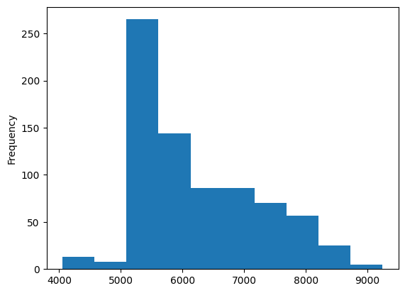
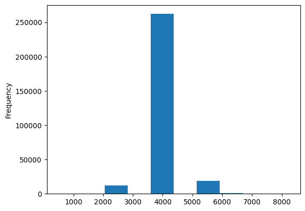

# Example: Tokenization

- This example shows how to tokenize a Korean corpus for fastText

## System envrionments

| system | version |
| --- | --- |
| Ubuntu | 18.04 LTS |
| Docker | 20.10.14 |

## Morphemes

- fastText tokenize a corpus based on the ASCII characters below:
1. **space**
2. tab
3. vertical tab
4. carriage return
5. formfeed
6. the null character
- But it's difficult to reflect the meaning if we tokenize Korean corpus based on spacing because Korean belongs to an agglutinative language
- So it’s more appropriate to tokenize it based on morphemes if we’re dealing with Korean
- One of the most famous korean morpheme analysis is `mecab-ko`
- It's a fork project of MeCab for korean morphological analysis
- It includes some exclusive features to address some challenges of Korean morphological analysis
- Besides, there are various projects as follows:
1. hannanum:: 한나눔 한국어 형태소 분석기 (HanNanum)
2. [꼬꼬마 세종 말뭉치 활용 시스템 (snu.ac.kr)](http://kkma.snu.ac.kr/)
3. https://github.com/shineware/KOMORAN
4. [MeCab: Yet Another Part-of-Speech and Morphological Analyzer (taku910.github.io)](http://taku910.github.io/mecab/)
5. https://github.com/open-korean-text/open-korean-text

## Jamo

- In Korean NLP tasks, we can see many methodologies which tokenize Korean by hangul jamo
- Because many people usually don't strictly follow grammar or spelling, but also intentionally add typos in the wilds
- E.g., toxic comments which include transformation by jamo to evade censorship (씨발 → ㅆㅣㅂㅏㄹ)
- So it may be appropriate to tokenize it based on jamo if we're dealing with Korean corpus from the internet
- Be cautious it may require additional computational cost to tokenize a corpus into jamo

## Ambiguity

- Proper nouns are one of the parts of speech where a lot of new words appears
- One of the main motivations for adjusting the priority is to disambiguate new vocabulary
- E.g., 걔는 비를 좋아한다 (She likes 비) → 비? 🧑‍🎤? 아니면 🌧️?
- If it’s difficult to estimate the appropriate cost, default dictionary in mecab-ko-dic might be helpful
- There are lots of homonyms in the default dictionary and it relieves the ambiguity by assigning a high cost to vobaculary to less used ones
- One-letter vocabulary in `Person.csv` and `Person-actor.csv` provided by mecab-ko-dic have much higher proportion of homonyms than the vocabulary that doesn’t
- And a trend of its cost also significantly different:

Figure 1. A bar chart showing the frequency of cost of a one-letter vocabulary in Person.csv and Person-actor.csv             | Figure 2. A bar chart showing the frequency of cost of two or more letter vocabulary in Person.csv and Person-actor.csv
:-------------------------:|:-------------------------:
  |  

### E.g., Adjusting costs to disambiguate korean name

1. Make sure the name we want to add already exists in `Person.csv` and `Person-actor.csv`
    - Exist if it already exists
    - If not, proceed
2. Make sure ther are homonyms in other `.csv` files
3. Determine the cost according to the presence of homonyms as follows:
    - If there’s no homonym, expectation of th costs in `Person.csv` and `Person-actor.csv`
    - If any homonym exists, assign a higher value than the existing vocabulary, and adjust it according to the result